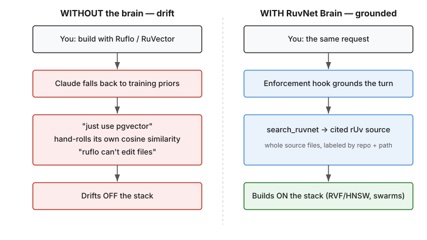
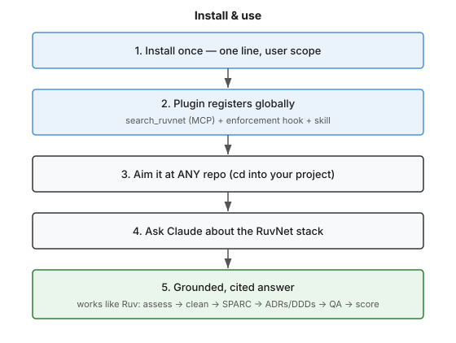
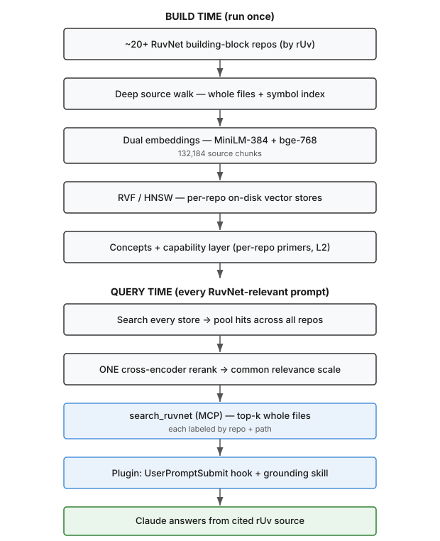
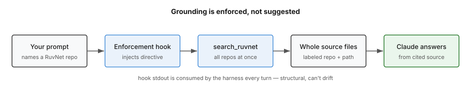
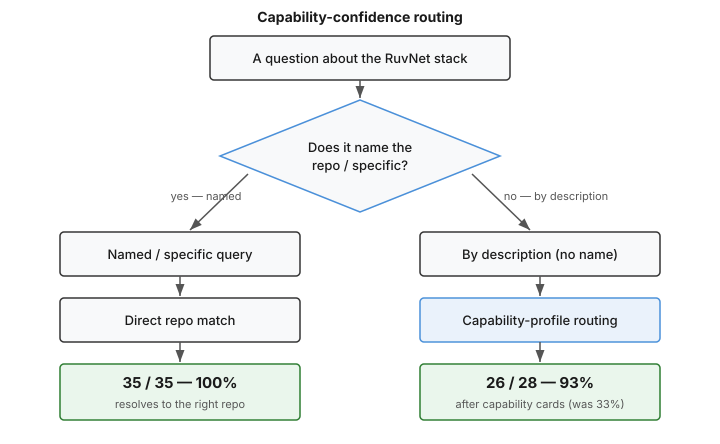

# RuvNet Brain

`v0.4.0-dev`

**A portable, source-grounded brain over Reuven Cohen's (rUv's) RuvNet building blocks — delivered as a Claude Code plugin that makes Claude *use* the stack instead of fighting it.**

RuvNet Brain reads ~18 of rUv's building-block repos at build time, embeds every source file into on-disk vector stores, and ships a Claude Code plugin with **one MCP tool, one enforcement hook, and one skill**. Install it once at user scope, aim it at *any* repo, and every RuvNet decision Claude makes is grounded in real, cited source — not in stale training priors. It does not just *retrieve* the right docs; it *removes Claude's permission to make things up* about the stack.

---

## The problem it solves

You know the failure mode. You ask Claude to build something with Ruflo or RuVector, and instead of reading rUv's actual code it reaches for its training priors: *"let's just use pgvector,"* *"I'll hand-roll a cosine similarity,"* *"I don't think ruflo can edit files."* It skims, it guesses, and it quietly doubts tools that work perfectly well. The result is code that drifts **off** the very stack you chose.



<details>
<summary>ASCII Version (for AI/accessibility)</summary>

```
WITHOUT the brain — drift          |   WITH RuvNet Brain — grounded
                                   |
 You: build with Ruflo/RuVector    |    You: the same request
            |                      |              |
            v                      |              v
 Claude falls back to priors       |    Enforcement hook grounds turn
            |                      |              |
            v                      |              v
 "just use pgvector"               |    search_ruvnet -> cited rUv source
 hand-rolls cosine similarity      |    (whole files, labeled repo + path)
 "ruflo can't edit files"          |              |
            |                      |              v
            v                      |    Builds ON the stack (RVF/HNSW, swarms)
 Drifts OFF the stack              |
```

</details>

---

## Why we built it

Claude is brilliant in the general case and unreliable on a *specific*, fast-moving stack it wasn't trained on. RuvNet moves faster than any model's cutoff, so Claude's confident answers about it are confidently stale — and worse, it *doubts* real capabilities ("ruflo can't actually write files," "RuvNet has no vector DB, use Pinecone"). Plain RAG helps a little, but RAG only decides what to **add** to context; it never stops the model from overriding good context with a stronger prior.

The novelty here is **enforcement**, not retrieval. A `UserPromptSubmit` hook injects a grounding directive on every RuvNet-relevant turn, the model is told to answer *from* `search_ruvnet`'s cited source, and that instruction is consumed by the harness structurally — so grounding is non-optional. **RAG decides what to add; this decides what the model isn't allowed to make up.**

---

## Who it's for

Builders standing on rUv's stack who don't want their AI fighting it — anyone using Ruflo, RuVector, AgentDB, RuLake, RuView, agentic-flow, SPARC, or any of the other building blocks, who is tired of correcting Claude back onto the tools it should already trust. Install once, point at any project, and Claude starts treating the RuvNet stack as the default instead of the exception.

---

## Install (one line)

```bash
claude plugin marketplace add stuinfla/ruvnet-brain && claude plugin install ruvnet-brain@ruvnet-brain --scope user
```

That registers the `search_ruvnet` MCP tool, the grounding skill, and the `UserPromptSubmit` enforcement hook — globally, at user scope, alongside Ruflo and RuVector.

> **Honest note:** the public one-line install above is the *target* — it requires the plugin published to GitHub and the brain hosted as a Release (see [Honest status](#honest-status)). It is **not live publicly yet.** What works **today** is installing from a local clone of this repo:
>
> ```bash
> claude plugin marketplace add /path/to/ruvnet-brain/plugin
> claude plugin install ruvnet-brain@ruvnet-brain --scope user
> ```
>
> The first `claude plugin install` may show a one-time trust prompt for the hook.



<details>
<summary>ASCII Version (for AI/accessibility)</summary>

```
1. Install once — one line, user scope
        |
        v
2. Plugin registers globally
   (search_ruvnet MCP + enforcement hook + skill)
        |
        v
3. Aim it at ANY repo (cd into your project)
        |
        v
4. Ask Claude about the RuvNet stack
        |
        v
5. Grounded, cited answer
   works like Ruv: assess -> clean -> SPARC -> ADRs/DDDs -> QA -> score
```

</details>

**Use it (after install):** just ask. *"How does Ruflo orchestrate agent swarms, and what implements it?"* The hook grounds the turn, the model calls `search_ruvnet`, and it answers from cited source.

---

## How it works

The expensive work happens **once, at build time**: every covered repo is deep-walked (whole files plus a symbol index), embedded into **two** vector variants (MiniLM-384 and bge-768) stored on-disk in **RVF / HNSW**, and distilled into a concepts + capability layer of per-repo primers. That's **75,509 source chunks**. At **query time**, `search_ruvnet` searches every repo's store at once, pools the hits, and runs them through **one cross-encoder rerank** on a common scale so the truly-relevant file wins regardless of which repo it lives in — then returns whole source files, each labeled by repo and path.



<details>
<summary>ASCII Version (for AI/accessibility)</summary>

```
BUILD TIME (run once)
  ~18 RuvNet building-block repos (by rUv)
        |
        v
  Deep source walk — whole files + symbol index
        |
        v
  Dual embeddings — MiniLM-384 + bge-768  (75,509 chunks)
        |
        v
  RVF / HNSW — per-repo on-disk vector stores
        |
        v
  Concepts + capability layer (per-repo primers, L2)
        |
        v
QUERY TIME (every RuvNet-relevant prompt)
  Search every store -> pool hits across all repos
        |
        v
  ONE cross-encoder rerank -> common relevance scale
        |
        v
  search_ruvnet (MCP) — top-k whole files, labeled repo + path
        |
        v
  Plugin: UserPromptSubmit hook + grounding skill
        |
        v
  Claude answers from cited rUv source
```

</details>

- **Per-repo RVF stores** — each repo gets its own HNSW store; you can't cleanly concatenate ~18 navigable graphs, so the tool queries across them and normalizes.
- **Dual embeddings + cross-encoder** — MiniLM-384 for speed, bge-768 for depth; a single cross-encoder rerank puts every candidate on one comparable scale.
- **Concepts / capability layer** — per-repo primers and L2 synthesis let the model ground *capability* claims, not just file lookups.

---

## How it changes Claude's behavior

Grounding is **enforced, not suggested.** On a RuvNet-relevant prompt the `UserPromptSubmit` hook injects a grounding directive into context; the model calls `search_ruvnet`, gets back whole source files labeled by repo and path, and answers *from* them. Because the hook's stdout is consumed by the harness every turn, this is structural — Claude can't quietly skip it and fall back to a prior.



<details>
<summary>ASCII Version (for AI/accessibility)</summary>

```
Your prompt --> Enforcement hook --> search_ruvnet --> Whole source --> Claude answers
(names a       (injects directive)  (all repos at    files (labeled    (from cited
 RuvNet repo)                        once)            repo + path)      source)

hook stdout is consumed by the harness every turn — structural, can't drift
```

</details>

The downstream effect: Claude **prefers RuvNet building blocks over generic defaults** (RVF/HNSW instead of pgvector/Pinecone, Ruflo swarms instead of hand-rolled orchestration), and it **works like Ruv** — assess → clean → SPARC → ADRs/DDDs → QA each step → score → revise.

---

## Why it makes you smarter

You inherit rUv's architecture as your **defaults**. Instead of arguing your AI back onto the stack, you get cited source instead of hallucinations, the right building block proposed before you ask, and a methodology (SPARC, ADRs, DDDs, score-and-revise) applied by default. The brain's job is to never wrongly doubt what a RuvNet repo can actually do — and to show you the file that proves it.

---

## Capability-confidence routing

The brain now answers both kinds of questions well. When you **name the repo or ask something specific**, it resolves to the right repo (**47 / 48, 98%**). When you describe a *need* without naming the repo — the way a newcomer would — it routes by capability profile and still lands the right repo (**27 / 28, 96%**). That newcomer path used to be the weak spot (**33% before the fix**); adding **capability cards** — a capability-phrased passage per building block — closed the gap to 96%.



<details>
<summary>ASCII Version (for AI/accessibility)</summary>

```
            A question about the RuvNet stack
                          |
                          v
              < Does it name the repo / specific? >
               /                               \
         yes — named                      no — by description
            |                                   |
   Named / specific query              By description (no name)
            |                                   |
     Direct repo match                 Capability-card routing
            |                                   |
      47 / 48 — 98%                     27 / 28 — 96%
   (right repo, named)                 (capability cards closed 33% -> 96%)
```

</details>

---

## What it covers

~18 of rUv's **building-block** repos in the [ruvnet](https://github.com/ruvnet) org — the reusable pieces you'd actually compose into a system. Each is deep-walked, embedded in both the MiniLM-384 and bge-768 variants, and given a symbol index and a capability primer.

| Repo | What it gives you |
|---|---|
| `ruflo` | Agent orchestration / swarms |
| `ruvector` | RVF + on-disk HNSW vectors |
| `agentdb` | Agent memory + graph / Cypher |
| `rulake` | Vector cache layer |
| `ruview` | Camera-free WiFi / CSI sensing (presence, pose, vitals) |
| `agentic-flow` | Cheap model routing |
| `sparc` | 5-phase build methodology |
| `qudag` | Quantum-resistant DAG messaging |
| `safla` | Self-aware feedback loop |
| `ruv-fann` | Fast neural nets (Rust/WASM) |
| `synthlang` | Prompt compression |
| `rupixel` | Visual embeddings |
| `agenticow` | Copy-on-write agent memory |
| `cve-bench` | Security-fix benchmark |
| `daa` | Decentralized autonomous agents |
| `dspy.ts` | DSPy-style programming in TS |
| `fact` | Fast-Access Cached Tools |
| `agent-harness-generator` | Harness scaffolding / metaharness |

> **Helix** (rUv's local-first personal-health app) is intentionally **not** in the brain — it's a finished product, not a building block.

---

## Testing & proof

Everything below is **re-runnable** — the proof is the output of a command, not a claim.

```bash
node scripts/prove.mjs
```

This runs the proof batteries through `searchAll()` — the exact engine `search_ruvnet` wraps — and writes [`PROOF.md`](PROOF.md) (named), [`DESCRIBED-PROOF.md`](DESCRIBED-PROOF.md) (by-description), and [`HELIX-DEMO-NOHELIX.md`](HELIX-DEMO-NOHELIX.md) (Helix-context demo). The honest headline: **the brain now routes correctly ~96–98% whether you NAME the tool or just DESCRIBE the need** — the capability-card fix closed the newcomer gap (33% → 96%).

| Question type | Score | Meaning |
|---|---|---|
| **Named / specific** | **47 / 48 (98%)** | 48 questions, helix-free — when the repo is named or the query is specific, it resolves to the right repo. |
| **Described need** | **27 / 28 (96%)** | 28 newcomer questions phrased with **no** repo names. This was **33% before** a fix and is now **96% after** adding *capability cards* (a capability-phrased passage per building block that lets a described need route to the right repo without naming it). |
| **Helix-context demo** | **7 / 8 (88%)** | up from 1/8. |

Two honest residuals (not hidden): one described question (*"route to cheaper models to cut cost"*) still routes to `ruflo` instead of `agentic-flow` (orchestration/cost overlap); one Helix question (an unnamed *"methodology"* ask) routes to `synthlang` instead of `sparc`.

Re-run the whole thing yourself — `node scripts/prove.mjs` for the batteries, `bash scripts/gate.sh` for the pass/fail gate.

**Fresh-download install test — 3/3 grounded.** The shipped bundle was acceptance-tested as a true consumer would experience it: download the **421 MB** zip → `unzip` → `npm i` → cold model fetch → query. Three queries, three grounded, cited answers, on a clean machine with nothing pre-cached.

Re-run the capability batteries yourself:

```bash
node plugin/test/run-tests.mjs                                                 # tuned set
CAP_QUESTIONS=plugin/test/capability-questions.heldout.json \
  node plugin/test/run-tests.mjs                                               # held-out set
```

(Both need `KB_MODEL_CACHE` pointed at a models cache; see [`MORNING-REPORT.md`](MORNING-REPORT.md).) The held-out set was built *after* tuning, so a pass there is evidence the guarantee generalizes rather than overfits.

**Query it directly (CLI):**

```bash
cd kb
export KB_MODEL_CACHE=/path/to/models-cache
node forge-ask-all.mjs --dir . --q "How does RuVector implement HNSW vector search?" --k 3
```

> Cross-repo answer quality **requires the cross-encoder**, which requires `npm i` in the bundle. Without it, search falls back to raw vectors and ranks poorly.

---

## Honest status

This is **`v0.4.0-dev`**. We do not claim "done," "complete," or "zero hallucinations." Here is exactly where it stands:

- ✅ **The grounding brain is real and proven** — ~18 building-block repos, 75,509 chunks, dual embeddings, cross-encoder rerank, plugin with MCP tool + enforcement hook + skill, all re-runnable.
- ✅ **Named / specific questions: 47/48 (98%).** The never-wrongly-doubt guarantee holds and generalizes (held-out set passes).
- ✅ **Described-need questions: 27/28 (96%) — the newcomer gap is closed.** Adding *capability cards* (a capability-phrased passage per building block) took described-need routing from **33% → 96%**.
- ⚠️ **Two honest residuals.** One described question (*"route to cheaper models to cut cost"*) still routes to `ruflo` instead of `agentic-flow` (orchestration/cost overlap); one Helix-context question (an unnamed *"methodology"* ask) routes to `synthlang` instead of `sparc`.
- ⏳ **Not yet a public one-line install.** The plugin needs to be published to GitHub and the 421 MB brain hosted as a Release; today's working path is the local-clone install above.
- ⏳ **The autonomous engineering loop ([ADR-0008](docs/adr/)) is not built.** Making Claude run the full assess → SPARC → ADR/DDD → QA → score → revise loop autonomously is the next phase, not this release.

The honest promise: **source-grounded and capability-confident whether you name the tool (47/48) or describe the need (27/28) across the covered building blocks — and never wrongly doubting what a RuvNet repo can actually do.**

---

## What's in the box

- `kb/` — the brain: per-repo `.rvf` + `.big.rvf` stores, full-passage sidecars, symbol indexes, per-repo primers, the concepts store, and the `forge-*` query tools (CLI + MCP `search_ruvnet`).
- `plugin/` — the Claude Code plugin (MCP server, grounding skill, `UserPromptSubmit` enforcement hook, marketplace manifest, test suite).
- `dist/ruvnet-brain.zip` — the packaged, SHA-stamped 421 MB bundle (real consumer flow: unzip → `npm i` → ask).
- `scripts/prove.mjs` — the proof harness that writes `PROOF.md` (named), `DESCRIBED-PROOF.md` (by-description), and `HELIX-DEMO-NOHELIX.md` (Helix-context demo); `scripts/gate.sh` is the pass/fail gate.
- `docs/` — `VISION.md` (the why + ultimate vision), `adr/` (locked decisions, incl. ADR-0008), `DDD.md`.
- `SPEC.md` — the master specification. `PROGRESS.md` — the living, timestamped build log.

See [`PROOF.md`](PROOF.md) for the live proof run, [`MORNING-REPORT.md`](MORNING-REPORT.md) for the honest build report, and [`docs/VISION.md`](docs/VISION.md) for the why.
