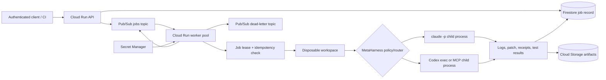

# Always-running MetaHarness coding service on GCP

Updated: 2026-07-16

**Status:** research only; no service, harness, cloud resource, or deployment has been created.  
**Research date:** 2026-07-16  
**Locally verified:** `metaharness@0.3.1`, `@metaharness/harness@0.1.0`, `@metaharness/host-claude-code@0.1.2`, `@metaharness/host-codex@0.1.2`, and `codex-cli 0.142.5`.

## Executive summary

A small, continuously available coding-agent service is feasible with MetaHarness as the generated harness/control-plane layer, a durable job queue, and replaceable Claude Code and Codex execution adapters. The simplest credible GCP topology is an authenticated Cloud Run API plus Pub/Sub and a Cloud Run worker pool kept at one or more instances; the worker pulls jobs, creates a disposable repository workspace, invokes either `claude -p` or Codex, publishes artifacts and status, and destroys the workspace.

For the first version, use Claude Code's non-interactive `-p` mode and Codex's non-interactive/MCP surface as bounded per-job child processes. Do **not** make a single immortal Claude or Codex session the reliability boundary. Keep the queue worker always running, but give every coding run a timeout, cancellation path, isolated workspace, and fresh process. Treat `codex app-server` as a later experimental adapter: it has richer thread/turn APIs, but OpenAI explicitly describes it and its WebSocket transport as experimental or unsupported for production.

## Scope and research questions

This report investigates:

1. What the npm MetaHarness packages generate and which host adapters are relevant.
2. How Claude Code `-p`, Claude MCP, Codex MCP, plugins, `mcp-server`, and `app-server` fit together.
3. Which process should be long-lived and which processes should be disposable.
4. A minimal GCP deployment topology for an always-available coding service.
5. Workspace, queue, secret, approval, observability, and failure-handling requirements.
6. A phased validation plan that precedes implementation.

Out of scope: creating a harness, writing service code, building a container, provisioning GCP, or testing provider credentials.

## Verified product surfaces

### MetaHarness

The npm registry identifies `metaharness` as a CLI that scaffolds focused agent harnesses and reports version `0.3.1` as `latest` on the research date. Its published README supports repeated `--host` options and lists both `claude-code` and `codex`. The generated Claude adapter emits Claude settings with MCP and hooks; the Codex adapter emits Codex MCP configuration. The upstream repository is [ruvnet/agent-harness-generator](https://github.com/ruvnet/agent-harness-generator), and the [npm package](https://www.npmjs.com/package/metaharness) is the authoritative release surface.

A likely future scaffold command is:

```bash
npx metaharness@0.3.1 coding-service \
  --template vertical:coding \
  --host claude-code \
  --host codex \
  --description "Queue-driven, isolated coding-agent worker"
```

This command is a proposal, not something executed during this research. Pinning the package version makes the generated result reproducible; upgrades should be explicit and followed by `harness doctor`, policy scanning, and a generated-file review.

`@metaharness/harness@0.1.0` describes itself as a deterministic control plane with safety gates, receipts, circuit breaking, verification, and worker selection. That is directionally aligned with this service, but its exact runtime API and production maturity need a spike before it becomes the durable job controller. MetaHarness should initially generate/configure the agent harness; the service must still own queue acknowledgements, leases, job state, process supervision, and workspace lifecycle.

### Claude Code

Anthropic documents `claude -p` as print/non-interactive mode that runs a query and exits. It supports JSON and streaming JSON output, bounded turns, model selection, explicit allowed/disallowed tools, session resume, and an MCP-backed permission prompt tool. These controls make it suitable as a per-job subprocess, not as the always-running daemon itself. See Anthropic's [Claude Code CLI reference](https://docs.anthropic.com/en/docs/claude-code/cli-usage) and [MCP overview](https://docs.anthropic.com/en/docs/mcp).

Recommended adapter contract:

- Start one process per job in the job workspace.
- Use structured output (`json` initially; `stream-json` when live events are needed).
- Set `--max-turns`, an outer wall-clock timeout, and an explicit tool allowlist.
- Send `SIGTERM`, then force-kill after a grace period; persist the last valid event first.
- Use API/enterprise authentication appropriate for unattended server workloads. Do not rely on a developer's interactive login state.
- Avoid `--dangerously-skip-permissions`. The container boundary is useful, but it is not a substitute for least-privilege tool policy.

### Codex CLI and MCP

The locally installed `codex-cli 0.142.5` exposes four distinct concepts:

| Surface | Purpose | Role in this design |
|---|---|---|
| `codex mcp` | Manage MCP servers consumed by Codex | Configure MetaHarness and repository tools available to Codex |
| `codex plugin` | Manage Codex plugin marketplaces/installations | Optional packaging/distribution layer; pin and preinstall in the image |
| `codex mcp-server` | Run Codex itself as an MCP server over stdio | Preferred MCP-native Codex adapter for an MVP |
| `codex app-server` | Rich JSON-RPC control plane for threads, turns, auth, approvals, skills, apps, and MCP | Later adapter only; experimental surface |

OpenAI's source documentation calls the [Codex MCP server interface](https://github.com/openai/codex/blob/main/codex-rs/docs/codex_mcp_interface.md) experimental and documents stdio transport, thread/turn operations, approvals, and the distinction from `codex mcp`. The [Codex app-server documentation](https://github.com/openai/codex/blob/main/codex-rs/app-server/README.md) says app-server powers rich interfaces, defaults to stdio, and has experimental/unsupported WebSocket transport. Therefore:

- Prefer `codex exec` for the simplest bounded subprocess integration, or `codex mcp-server` when MetaHarness should invoke Codex as a tool through MCP.
- Keep `codex mcp-server` private and local to the worker container. Stdio is a process transport, not a remotely exposed network service.
- Do not expose `codex app-server --listen ws://...` as the public service API in the MVP.
- If app-server is evaluated later, place a stable service-owned API in front of it, pin the Codex version, implement initialization/approval/event handling, and assume protocol migration work.
- Bake plugins and MCP server configuration into an immutable image or startup-generated `CODEX_HOME`; do not let arbitrary jobs install plugins or mutate shared global configuration.

## Recommended architecture



### Why this topology

Cloud Run now offers services, jobs, and worker pools. Google describes worker pools as continuously running, non-HTTP, pull-based workers, including Pub/Sub consumers; unlike services, they have no endpoint and no automatic scaling. A minimum instance count of one gives the requested always-running behavior, while a separate Cloud Run service provides an authenticated HTTPS control plane. See [What is Cloud Run](https://cloud.google.com/run/docs/overview/what-is-cloud-run) and [Deploy worker pools](https://cloud.google.com/run/docs/deploy-worker-pools).

Cloud Run Jobs are a valid alternative when every coding task should receive a whole new task container and startup latency is acceptable. They are less natural for a continuously pulling agent. GKE is justified only if the service later needs stronger pod-level isolation, custom autoscaling, privileged build machinery, persistent volumes, or long-lived interactive sessions beyond Cloud Run's constraints.

### Components

1. **API service:** accepts a repository reference, immutable revision, task, provider policy, budgets, callback metadata, and idempotency key. It validates inputs, creates a job record, publishes only a job ID, and returns `202 Accepted`.
2. **Pub/Sub:** durable work notification. Default delivery is at least once, so workers must be idempotent. A pull subscription can enable exactly-once delivery within a region, but job-state compare-and-set remains necessary because publish retries and external side effects can still duplicate work. Configure a dead-letter topic. See [Pub/Sub subscription overview](https://cloud.google.com/pubsub/docs/subscription-overview), [exactly-once delivery](https://cloud.google.com/pubsub/docs/exactly-once-delivery), and [dead-letter topics](https://cloud.google.com/pubsub/docs/handling-failures).
3. **Job store:** Firestore is sufficient for MVP state (`queued`, `leased`, `running`, `succeeded`, `failed`, `cancelled`) and lease fencing. A job transition must include the expected prior state and lease generation.
4. **Worker pool:** keeps a streaming-pull subscriber alive. Limit each instance to one active coding job initially. Extend the Pub/Sub lease while the child process runs; acknowledge only after durable final state and artifact writes.
5. **Workspace manager:** creates a unique temporary directory, shallow/fetches the requested immutable commit using a short-lived credential, removes repository-provided credential files, and deletes the directory after artifact upload. Never reuse a writable checkout across tenants or jobs.
6. **MetaHarness layer:** supplies the coding template, host configs, MCP policy, routing/verification concepts, and receipts. The service wrapper remains responsible for provider-independent lifecycle control.
7. **Execution adapters:** normalize start, event stream, timeout, cancellation, result, token/cost metadata, and patch/test artifacts across Claude and Codex.
8. **Artifact store:** Cloud Storage stores compressed logs, patches, receipts, and test output. Firestore stores only indexes, status, checksums, and compact summaries.

## Job lifecycle

1. Authenticate and authorize the caller; reject mutable repository references unless policy allows them.
2. Create the job atomically by idempotency key and publish its ID.
3. Pull, acquire a fenced lease, and start periodic lease extension.
4. Materialize a disposable workspace at the exact commit and apply repository policy.
5. Select the Claude or Codex adapter according to explicit request or MetaHarness routing policy.
6. Spawn the provider process with fixed model/tool/turn/time/cost limits and capture structured events.
7. Run independent verification commands in a stricter, non-agent shell policy where possible.
8. Persist patch, logs, receipts, test results, and checksums; update final job status.
9. Acknowledge the queue message only after final state is durable.
10. Revoke temporary credentials, terminate descendants, and delete the workspace on every exit path.

The service should produce a patch or branch reference, not push or merge by default. Repository writes, pull-request creation, and deployment are separate capabilities requiring explicit authorization and policy.

## Security and tenancy requirements

- Run as a dedicated service account with only subscription consume, scoped artifact write, job-store access, and named secret access.
- Store provider and source-control credentials in Secret Manager, grant least privilege, pin secret versions, and enable data-access logging. These are current Google recommendations in [Secret Manager best practices](https://cloud.google.com/secret-manager/docs/best-practices).
- Prefer short-lived workload identities or installation tokens over long-lived personal tokens.
- Separate control-plane identity from per-repository credentials; never include secrets in prompts, queue payloads, logs, or artifacts.
- Default-deny MCP tools. Allow only named servers/tools for a job class, with call limits and timeouts. Network egress should be allowlisted when practical.
- Treat repository contents, issues, and tool output as untrusted prompt input. Repository instructions cannot grant new cloud, MCP, network, or secret capabilities.
- Use rootless/non-root execution, read-only container filesystem except for the workspace, resource limits, process-group cleanup, and no Docker socket.
- A Cloud Run container is a useful boundary but not necessarily sufficient for mutually untrusted public tenants executing arbitrary builds. For that threat model, evaluate one job per Cloud Run Job, GKE Sandbox/gVisor, or dedicated projects before launch.
- Keep audit receipts immutable enough to reconstruct who requested a run, source revision, image digest, harness version, provider/model, policy, tools, commands, outputs, and final artifact hashes.

## Reliability and operational policy

The always-running unit should be the queue consumer, not an agent conversation. Provider processes are disposable and recoverable.

Minimum controls:

- Job-level wall-clock timeout and provider-specific turn/token/cost budget.
- Heartbeat plus fenced lease; stale workers cannot finalize jobs after a replacement acquires a newer lease.
- Idempotent artifact keys (`job-id/attempt-id/...`) and compare-and-set finalization.
- Bounded retries by failure class: transient provider/network failures retry; policy, authentication, and deterministic test failures do not.
- Dead-letter topic with a human-visible failure reason.
- Startup and liveness probes for deadlock detection. Cloud Run worker pools support these, but Google notes a failed worker receives `SIGTERM` and only a short shutdown grace period; cancellation and checkpointing must be prompt. See the [container runtime contract](https://cloud.google.com/run/docs/container-contract) and [worker-pool health checks](https://cloud.google.com/run/docs/configuring/workerpools/healthchecks).
- Metrics: queue age, active jobs, lease loss, completion rate, retry/DLQ rate, provider latency/errors, token/cost, workspace setup time, verification result, and orphan child-process count.
- Structured logs keyed by job, attempt, provider, repository hash, and image digest; redact command environment and model context.

## Options considered

| Option | Advantages | Problems | Recommendation |
|---|---|---|---|
| Cloud Run service with background loop | One resource and HTTPS endpoint | Request-oriented lifecycle; easy to mix control and execution concerns | Avoid for the durable worker |
| Cloud Run API + worker pool | Native HTTPS control plane plus always-on pull worker | Worker pool has no automatic scaling; billed while active | **MVP choice** |
| Cloud Run API + one Job execution per task | Stronger task isolation and natural completion semantics | More orchestration and cold-start latency; not literally always-running | Strong security-oriented alternative |
| GKE | Maximum control over isolation, volumes, scaling, and daemons | Highest operational burden | Revisit for multi-tenant or advanced build workloads |
| Long-lived `claude`/Codex conversation | Warm context and possible latency savings | State leakage, drift, memory growth, fragile cancellation/recovery | Reject |
| `codex app-server` over WebSocket | Rich remote control and events | Experimental; WebSocket transport unsupported for production | Research spike only |

## Phased validation plan

### Phase 0: contract and threat model

- Define the job schema, state machine, artifact contract, approval model, and trust boundaries.
- Decide whether the initial service is single-tenant/internal or handles mutually untrusted repositories.
- Fix maximum repository size, runtime, CPU/memory, spend, tool calls, and artifact retention.
- Decide whether outputs are patch-only or may create remote branches/PRs.

### Phase 1: local disposable-run spike

- Scaffold a pinned `vertical:coding` multi-host harness outside this repository.
- Run `harness doctor`, signing/verification, and MCP policy scans.
- Execute the same read-only coding task once through `claude -p` and once through Codex.
- Prove structured-event parsing, timeout, cancellation, process-tree cleanup, workspace deletion, and deterministic artifact capture.
- Compare `codex exec` with `codex mcp-server`; keep whichever has the smaller stable integration surface.

### Phase 2: single GCP worker

- Deploy private API, Firestore state, Pub/Sub pull subscription and DLQ, artifact bucket, Secret Manager entries, and one worker-pool instance.
- Enforce one job at a time, patch-only output, no source-control writes, and a narrow repository allowlist.
- Test redelivery, lease expiry, provider outage, worker termination, malformed events, oversized repository, runaway command, cancellation, and secret redaction.

### Phase 3: hardening and controlled concurrency

- Add per-job identity/credentials, policy profiles, cost quotas, verification gates, artifact retention, dashboards, alerts, and incident runbooks.
- Load-test with two providers and controlled concurrency. Verify no workspace, child process, MCP process, credential, or conversation survives job cleanup.
- Add manual or custom worker-pool scaling from queue backlog; worker pools do not autoscale natively.

### Phase 4: experimental richer control

- Evaluate pinned `codex app-server` behind a private adapter only if steering, resume, or rich live UI materially improves the product.
- Run compatibility tests against every proposed Codex upgrade and retain a `codex exec`/MCP fallback.
- Consider persistent sessions only for a single trusted tenant, with expiry, explicit repository binding, and resource caps.

## Open questions

1. Is this an internal single-tenant service, or will it execute repositories from unrelated users? This determines the required isolation tier.
2. Must agents push commits/open PRs, or is a signed patch artifact sufficient?
3. Which unattended authentication methods and commercial terms are approved for Claude Code and Codex in GCP?
4. What job duration, concurrency, and monthly spend envelope should drive worker count and provider routing?
5. Does `@metaharness/harness` have a sufficiently stable API for production job orchestration, or should it remain a policy/router inside a service-owned state machine?
6. Are live steering and resumable conversations required? If not, the experimental app-server surface can be avoided.
7. Which build/test commands may run, and what outbound network destinations do they require?

## Evidence quality

| Finding | Quality | Basis |
|---|---|---|
| MetaHarness current package/host support | High | Live npm package metadata and upstream repository |
| Claude `-p` automation controls | High | Anthropic CLI documentation plus a local parallel `claude -p` run |
| Codex CLI surface and version | High | Local `codex 0.142.5 --help` and OpenAI's official source documentation |
| Cloud Run worker-pool behavior | High | Current Google Cloud documentation |
| Recommended queue/worker architecture | Medium | Engineering synthesis from verified platform behavior; not benchmarked |
| Production suitability of `@metaharness/harness` | Low/unknown | Package description verified; runtime API and operational maturity not validated |
| Cost/performance | Unknown | No workload, region, model mix, or benchmark supplied |

## Parallel Claude research note

An independent `claude -p` research prompt was run in parallel as requested. Its delegated web tools were denied by that Claude session, so it correctly declined to provide uncited fast-moving claims. No claims from that run were treated as evidence. The final report instead cross-checks local CLI/package observations against official Anthropic, OpenAI, upstream MetaHarness, and Google Cloud sources.

## Recommendation

Proceed to a time-boxed local spike only after resolving the tenancy and output-authority questions. The default implementation target should be:

> pinned multi-host `vertical:coding` MetaHarness + private Cloud Run API + Firestore job state + Pub/Sub pull/DLQ + one Cloud Run worker-pool instance + disposable workspaces + per-job `claude -p` or Codex subprocess + patch-only artifacts.

Defer `codex app-server`, persistent agent sessions, arbitrary plugin installation, source-control writes, and autoscaled multi-tenancy until the bounded subprocess design passes failure, cleanup, and security tests.
