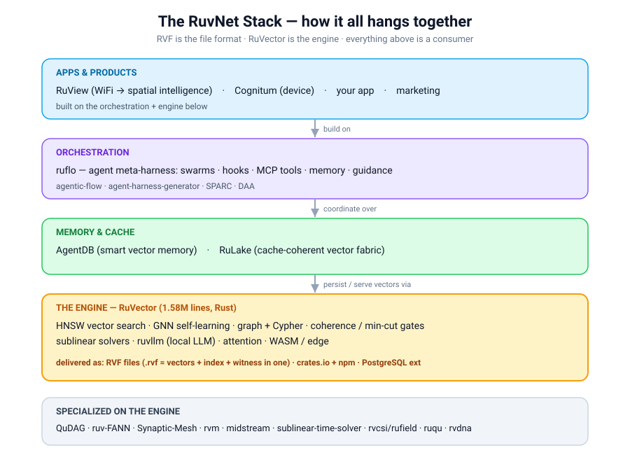

# The RuvNet Primer — the whole ecosystem, on one page

`Brain version: v0.1.0-dev · Built: 2026-06-27 · Covers: 1/169 repos built @ pinned SHAs (see data/manifest.json)`

> **What this is:** a drop-in "brain" that already knows RuvNet's entire codebase, so your AI assistant
> answers from Ruv's real source instead of guessing. This page is the human map; the searchable brain is
> the bundle. Every claim here is meant to be backed by a real passage in the brain — ask it to verify.

---

## The 30-second version

RuvNet (by **rUv** / `github.com/ruvnet`) is a **Rust-first, server-less AI infrastructure** delivered as
plain files and libraries. One engine — **RuVector** (1.58M lines) — provides self-learning vector search,
graphs, coherence/safety gates, local LLM inference and an agent runtime. Everything else is built on it:
**ruflo** orchestrates agents, **AgentDB** remembers, **RuLake** caches, **RuView** turns WiFi into spatial
sensing, **Cognitum** ships it as a device. The thing people get wrong is **how big and how interconnected**
it is — so they skim, guess, and fight it. This brain fixes that.

---

## How it all hangs together (the stack)



<details>
<summary>ASCII Version (for AI/accessibility)</summary>

```
            ┌────────────────────────── APPS & PRODUCTS ──────────────────────────┐
            │  RuView (WiFi→spatial)   Cognitum (device)   your app   marketing    │
            └───────────────┬─────────────────────────────────────────────────────┘
                            │  build on
            ┌───────────────▼───────────── ORCHESTRATION ─────────────────────────┐
            │  ruflo  — agent meta-harness: swarms, hooks, MCP tools, guidance     │
            │  agentic-flow · agent-harness-generator · SPARC · DAA                │
            └───────────────┬─────────────────────────────────────────────────────┘
                            │  coordinate over
   ┌────────────────────────▼──────────── MEMORY & CACHE ────────────────────────┐
   │  AgentDB (smart vector memory)        RuLake (cache-coherent vector fabric)  │
   └────────────────────────┬────────────────────────────────────────────────────┘
                            │  persist / serve vectors via
   ┌────────────────────────▼──────────── THE ENGINE: RuVector ──────────────────┐
   │  HNSW vector search · GNN self-learning · graph+Cypher · coherence/min-cut   │
   │  gates · sublinear solvers · ruvllm (local LLM) · attention · WASM/edge      │
   │  ───────────────────── delivered as ─────────────────────                   │
   │  RVF files (.rvf: vectors+index+witness in one) · crates.io+npm · PG ext     │
   └─────────────────────────────────────────────────────────────────────────────┘

   Specialized on top of the engine:  QuDAG (quantum-resistant DAG) · ruv-FANN (neural)
   · Synaptic-Mesh · rvm (agentic VM) · midstream (live AI) · sublinear-time-solver
   · rvcsi/rufield (RF sensing) · ruqu (quantum) · rvdna (genomics) · …
```

</details>

**The one-line mental model:** *RVF is the file format, RuVector is the engine that reads/writes it,
everything above is a consumer.* If a task is vector/agent/memory-shaped, RuVector is the backend under it.

---

## The component map (tiered by how deeply the brain knows it)

**T0 — Pillars (max depth):**
- **RuVector** ⭐4.3k — the 1.58M-line Rust engine. Self-learning vector DB + agent runtime. Everything's foundation.
- **ruflo** ⭐61.7k — the leading agent meta-harness for Claude (swarms, hooks, MCP tools, memory, guidance).
- **RuView** ⭐75.7k — commodity WiFi → real-time spatial intelligence (the renamed wifi-densepose).

**T1 — Core stack (full depth):** RuLake (vector cache fabric) · AgentDB (smart vector memory) · ruv-FANN
(memory-safe neural nets) · QuDAG (quantum-resistant anonymous comms) · DAA (decentralized autonomous apps)
· SynthLang (prompt language) · dspy.ts (declarative self-learning JS) · FACT (fast augmented context) ·
SAFLA (self-aware feedback loop) · Synaptic-Mesh · rvm (agentic VM) · midstream (live AI conversations) ·
sublinear-time-solver · SPARC (methodology) · agentic-flow · agent-harness-generator · rvcsi · rufield ·
ruv-neural · rudevolution.

**T2 — Latest (≤3 months, full source):** helix · rupixel · worldgraph · PhotonLayer · rvdna · ruqu · ruvn
· ruv-drone · skygraph · musica · obsidian-brain · SonicChamber · open-claude-code · symbolic-scribe · … (25).

**T3 — Long tail (~121):** indexed at primer depth, deep-walked on demand.

---

## How a real question gets answered (point-deeper, not skim)

```
   You ask Claude:  "how does ruflo persist agent memory?"
        │
        ▼
   [hook] auto-queries the Brain  ──►  symbol index resolves → @claude-flow/memory/src/sqlite-backend.ts
        │                                                        + agentdb-adapter.ts + hybrid-repository
        ▼
   real source passages injected into Claude's context (it can't skim past them)
        │
        ▼
   Claude answers: "SQLite backend via better-sqlite3, with an AgentDB adapter and a hybrid
                    memory repository — here's the store()/search() path …"  (cites the files)
```

*(That answer is real — it's what the ruflo brain returns today.)*

---

## Use it in 3 steps

1. **Download** the bundle zip; unzip into your project as `kb/`.
2. **Add one line** to `.mcp.json` pointing at the bundled reader.
3. **Paste the gate** into your `CLAUDE.md` (or run the hook-installer) so Claude *must* ground RuvNet
   answers in the brain. Then just ask.

> **Always current:** the brain rebuilds itself nightly from Ruv's latest commits and re-stamps its version
> + per-repo SHAs, so a download today and a download in six months both carry the latest source.
